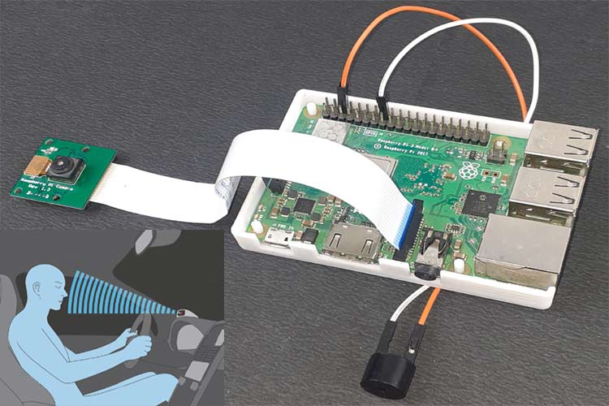
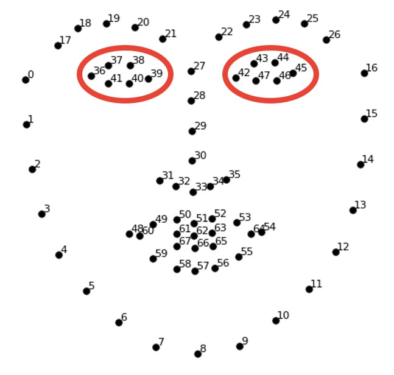

+++
title = "Driver Drowsiness Detection"
description = "Detecting Driver face and detect drowsiness and then alert driver"
date = 2020-10-10T07:34:48+08:30
featured = false
draft = false
comment = false
toc = false
reward = false
categories = [
  "Computer Vision"
]
tags = [
  "Face Detection",
  "Image Processing"
]
series = []
images = ["images/home.png"]
+++
Hi guys,How are you? I hope you guys are fine and missing my blogs so much.. Hah!!

This time I coming with a new topic mostly based on Image processing and ComputerVision technologies. Its sounds little bit different than previous blog, isn't it?  In this blog, we address a drowsy driver alert system that has been developed using such a technique in which the Video Stream Processing (VSP) is analyzed by eye blink concept through an Eye Aspect Ratio (EAR) and Euclidean distance of the eye. Face landmark algorithm is also used as a proper way to eye detection. When the driver’s fatigue is detected, the IoT module issues a warning message along with impact of collision and location information, thereby alerting with the help of a voice speaking through the Raspberry Pi monitoring system.


Lets dive into the problem and discuss how this can be solve by using Image Processing techniques.First of all what we need to do in this problem is to Detect face and eyes to calculate EAR ratio of eyes. 
So If a face is found, we apply facial landmark detection and extract the regions.Now that we have the eye regions, so we can calculate EAR to check whether the eyes are closed or not..! Initially I didn't get correct output until many trails and errors.
### Lets start .. include required libraries
```python3
import numpy as np
import os,time,sys
import cv2
import dlib
```
Hah .. ! You guys may think why cv2, dlib and numpy libraries.
cv2 is for computervision, dlib used to plot facial landmarks over Drivers face,numpy is used to manipulate Image arrays.
Well okay.. Do we really need time library? Do we need to calculate time or something **😒**.. \*(-_-)\*?  Ofcourse, Yes. We need to calculate time difference between blink of an eye. Its sounds intresting, isn't it? But I was irritated first time when I try to develop a algorithm to solve this program.

### Recognize Face and EYEs
```python3
cap=cv2.VideoCapture(0)
detector=dlib.get_frontal_face_detector()
predictor=dlib.shape_predictor("shape_predictor_68_face_landmarks.dat")
_,frame=cap.read()
gray=cv2.cvtColor(frame,cv2.COLOR_BGR2GRAY)
faces=detector(gray)
font=cv2.FONT_HERSHEY_SIMPLEX
for face in faces:
            x=face.left()
            y=face.top()
            h=face.right()
            k=face.bottom()
            #cv2.rectangle(gray,(x,y),(h,k),(0,255,0),1)
            landmarks=predictor(gray,face)
            eye1=[]
            for n in range(36, 42):
                eye1.append(landmarks.part(n))
                x = landmarks.part(n).x
                y = landmarks.part(n).y
                cv2.circle(gray, (x, y), 1, (255, 0, 0), 0)
            eye2=[]
            for n in range(42, 48):
                eye2.append(landmarks.part(n))
                x = landmarks.part(n).x
                y = landmarks.part(n).y
                cv2.circle(gray, (x, y), 1, (255, 0, 0), 0)
```
🤧.. What? whats happening on above code ah? Looks like irritating..😖,
Dont worry I will explain hehe..hah..🥲😅.

Let me explain the above code, loading dlib facial landmarks and read an image frame from camera. Apply pretrained dlib facial landmarks alogrithm on resultant frame. There are total 68 facial landmarks (based on the model we choose).

In 68 landmarks, from 36 to 42 denote left eye and from 42 to 48 denotes right eye.


### Calculate EAR (Eye Aspect Ratio)
```python3
def calculus(l):
    x_d=(l[1][0]-l[5][0])**2
    y_d=(l[1][1]-l[5][1])**2
    p2_p6=np.sqrt(x_d+y_d)
    x_d=(l[2][0]-l[4][0])**2
    y_d=(l[2][1]-l[4][1])**2
    p3_p5=np.sqrt(x_d+y_d)
    x_d=(l[0][0]-l[3][0])**2
    y_d=(l[0][1]-l[3][1])**2
    p1_p4=np.sqrt(x_d+y_d)
    ratio=(p2_p6+p3_p5)/p1_p4
    return ratio
eye=[]
for i in eye1:
        p=str(i)
        try:
            x=int(p[1:4].strip())
            y=int(p[6:len(p)-1].strip())
        except:
            x=int(p[1:3].strip())
            y=int(p[5:len(p)-1].strip())
        eye.append([x,y])
ratio1=calclus(eye)
eye=[]
for i in eye2:
        p=str(i)
        try:
            x=int(p[1:4].strip())
            y=int(p[6:len(p)-1].strip())
        except:
            x=int(p[1:3].strip())
            y=int(p[5:len(p)-1].strip())
        eye.append([x,y])
ratio2=calclus(eye)
EAR=(ratio1+ratio2)/4
```
Yoooo,Hohooo 🥳, we calculated the EAR(Eye Aspect Ratio) very finely.
Really? How? I don't understand the calculus part.. it looks like bricksblock in a row with some mathematical expression.


Simply its calculates the `((p2-p6)+(p3-p6))/(p1-p4)` hehe..^_^

BOOM! we already achieved our final solution. Really? Ofcourse, Yes. we just need a loop to read frames from the camera and calculate EAR difference between two consecutive seconds.So we have to find the time difference and check if the EAR crossed threshhold values then check if the time difference between last blink time and present time crosses 2 seconds, then it means the driver going to sleep. So we need to play a alarm to wake him up.That's it..! Done..🥲😌

I think its fine and I really dont want to explain more than this 😜🙃.


[detection_.py](files/Detection.py)

Hope you guys like this and Subscribe my Utube account 😂😂.

---

##### Thanks for reading! {align=center}
