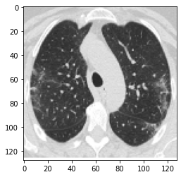
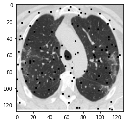
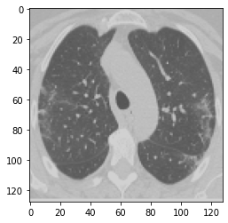
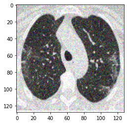
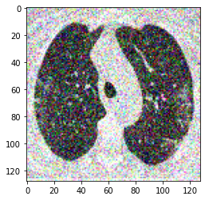

+++
title = "Image Restoration Using GAN's Part-1"
description = "Image Restoration with GAN's for medical field problems"
date = 2020-09-06T07:34:48+08:30
featured = false
draft = false
comment = false
toc = false
reward = false
categories = [
  "GAN's"
]
tags = [
  "Machine Learning",
  "Deep Learning",
  "Image Processing"
]
series = []
images = ["images/home.jpg"]
+++

## What is GAN's?
Generative Adversarial Networks [GAN's](https://arxiv.org/abs/1406.2661) are one of the most interesting ideas in computer science today. Two models are trained simultaneously by an adversarial process. A generator learns to create images that look real, while a discriminator learns to tell real images apart from fakes.


### **Case:**
I have read that, in most of the cases Doctors may face issues while they are making decisions over CT scanned Images because of Gaussian Noise and making electronic Noise (unwanted disturbance in a signal which is reflected in output).
So I tried to implement and train a Deep Learning model using GAN Technology.


##### **Brief Solution:**
Step-1. Preprocessing the Data to train the model.

Step-2. Generator Model: Used to generate new images which look like real images.

Step-3. Discriminator Model: Used to classify images as real or fake.

Step-4. Fitting the model.


##### **Detailed Solution:**

We’ll begin by importing needed libraries, considering you’ve installed all the necessary libraries already.

```python3
import matplotlib.pyplot as plt
from IPython.display import display, HTML
from PIL import Image,ImageFile
import tensorFlow as tf
from io import BytesIO
import numpy as np
import os,sys,math

%matplotlib inline
```
Okay,the libraries are succesfully imported and lets go to the next part of this process. Define some filters manually using numpy and image processing techniques to morph the original image.
```python3
def add_noise(a):
    a2 = a.copy()
    rows = a2.shape[0]
    cols = a2.shape[1]
    s = 2 # size of spot is 1/20 of smallest dimension
    
    for i in range(100):
        x = np.random.randint(cols-s)
        y = np.random.randint(rows-s)
        a2[y:(y+s),x:(x+s)] = 0
        
    return a2

```
Now we had defined a simple noise funtion which is used to add some random noise pixels (blocks) to the input image 'a'.Let's try to load and pass the image to test above noise function.
```python3
image = tf.io.read_file('sample.png')
img = tf.image.decode_png(image , channels=3)
img = tf.image.convert_image_dtype(img, tf.float32)
img = tf.image.resize(img, [128, 128])
plt.figure()
plt.imshow(img)
img_array = np.asarray(img)
#cols, rows = img.size
# Add noise
img_array_noise = add_noise(img_array)
plt.figure()
plt.imshow(img_array_noise)
```



Great, We have successfully implemented the noise function.Lets implement some more funtions which are also behaving like above noise functions but with different different noises.
```python3
def contrast(img):
  img=tf.image.random_contrast(img, 0.5, 0.7)
  return img
  
img_array_noise = contrast(img_array)
plt.figure()
plt.imshow(img_array_noise)
```

```python3
def pepper_noise(img):
  noise_factor = 0.08
  input_image = img + noise_factor * tf.random.normal(img.shape)
  input_image = tf.squeeze(tf.clip_by_value(input_image, clip_value_min=0., clip_value_max=1.))
  return input_image
  
img_array_noise = pepper_noise(img_array)
plt.figure()
plt.imshow(img_array_noise)
```

```python3
def gaussian_noise(image):
    with tf.name_scope('Add_gaussian_noise'):
        noise = tf.random.normal(shape=tf.shape(image), mean=0.0, stddev=(50)/(255), dtype=tf.float32)
        noise_img = image + noise
        noise_img = tf.clip_by_value(noise_img, 0.0, 1.0)
    return noise_img
    
img_array_noise = gaussian_noise(img_array)
plt.figure()
plt.imshow(img_array_noise)
```


Let's do the same for the whole data set and load them into pickle using numpy arrays for future use.
```python3
import pickle

os.chdir('/content/drive/MyDrive/project')
if 'data.pkl' in os.listdir():
  data=1
  file = open("/content/drive/MyDrive/project/data.pkl", "rb");
  x = pickle.load(file)
  y = pickle.load(file)
else:
  x = np.array([],dtype=tf.float32)   
  y = np.array([],dtype=tf.float32)
```
```python3
for path, subdirs, files in os.walk('path/training_images/'):
  for name in files:
    name = os.path.join(path,name)
    print(name,i)
    image = tf.io.read_file(name)
    img = tf.image.decode_png(image , channels=3)
    img = tf.image.convert_image_dtype(img, tf.float32)
    img = tf.image.resize(img, [128, 128])
    
    a=0
    # Add noise
    if a%4==0:
      img_array_noise = add_noise(img_array)
    elif a%4==1:
      img_array_noise = pepper_noise(img_array)
    elif a%4==2:
      img_array_noise = gaussian_noise(img_array)
    else:
      img_array_noise =contrast(img_array)
    a+=1
    x=np.append(x,[img_array],axis=0)
    y=np.append(y,[img_array_noise],axis=0)
x.shape,img_array.shape
```
	((9287, 128, 128, 3), (128, 128, 3))

Lets check the loaded pickle data by loading the pickle.file and seee what comes.
```python3
import pickle
if data != 2:
  plt.figure()
  plt.imshow(x[5001])
  
  # Write to file.
  file = open("/content/drive/MyDrive/project/data.pkl", "wb")
  pickle.dump(x, file)
  pickle.dump(y, file)
  file.close()
x_train.shape,x_train_noisy.shape
```


	((9287, 128, 128, 3), (9287, 128, 128, 3))

Yahooo! we are complete preprocessing the data for training GAN's.
Source [dataPreprocessing.ipynb](files/data_preprocessing_for_restoration.ipynb)


##check part-2 for GAN's implementation
---

##### Thanks for reading! {align=center}
