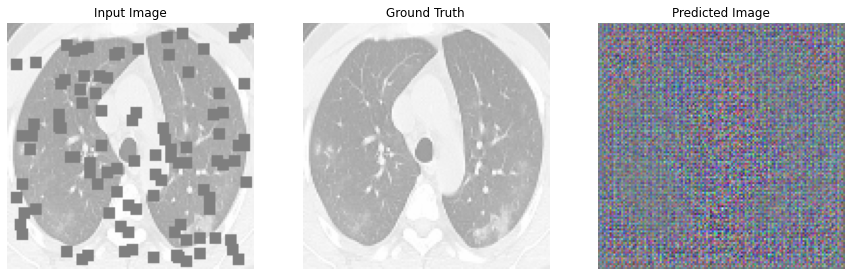
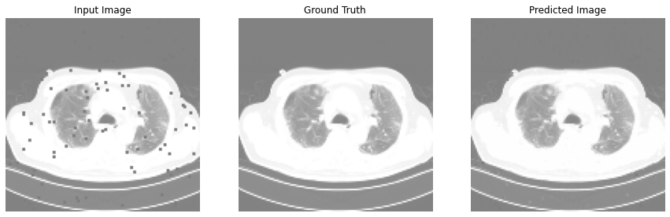

+++
title = "Image Restoration Using GAN's Part-2"
description = "Image Restoration with GAN's for medical field problems"
date = 2020-09-06T07:34:48+08:30
featured = false
draft = false
comment = false
toc = false
reward = false
categories = [
  "GAN's"
]
tags = [
  "Machine Learning",
  "Deep Learning",
  "Image Processing"
]
series = []
images = ["images/home.jpg"]
+++

## Lets continue the part-1 ^_^ ;)..,
We already know that what GAN's are and why they are used. Well, not really. GANs belong to implicit learning methods. In explicit learning models, the model learns its weights directly from the data. whereas in implicit learning, the model learns without the data directly passing through the network.  so it is reinforcement learning? Not really Hah..,!

As of now,we already discussed that GAN's have two model, and two models are trained simultaneously by an adversarial process. A generator learns to create images that look real, while a discriminator learns to tell real images apart from fakes. See what happens in this contest of discrimination and generation, we may think while the generator is almost discriminated, so it was trained heavely but the thing is the discriminator also trained harldy to discriminate images for small mistakes also.This is why GAN's became intresting in Neural Networks.


#### Load required libraries
```python3
from tensorflow import keras
import tensorflow as tf
import numpy as np
from tensorflow.keras.preprocessing import image_dataset_from_directory
from IPython import display
import os,time
```
#### Loading pickled data into NumPy array
Load the Preprocessed Data into NumPy array which is created in Part-1. Pickled data contains preprocessed image data in array format.
```python3
import pickle
# Read from file.
file = open("/../../data.pkl", "rb");
x_train = pickle.load(file)
x_train_noisy = pickle.load(file)
file.close()
```

#### spliting Data into Train and test data
The train_test_split function allows you to break a dataset with ease while pursuing an ideal model. Also, keep in mind that your model should not be overfitting or underfitting.
```python3
from sklearn.model_selection import train_test_split
x_train_, x_test, x_train_noisy_, x_test_noisy = train_test_split(x_train, x_train_noisy,shuffle=128)

BUFFER_SIZE = 400
BATCH_SIZE = 64
IMG_WIDTH = 256
IMG_HEIGHT = 256
EPOCHS = 150
OUTPUT_CHANNELS = 3
```
## Implementation of GAN's

##### Upsampling and Downsampling of an Image
Downsampling is the process of reducing the sampling rate of a signal. Downsample reduces the sampling rate of the input AOs by an integer factor by picking up one out of N samples. Note that no anti-aliasing filter is applied to the original data.
```python3
def downsample(filters, size, apply_batchnorm=True):
  initializer = tf.random_normal_initializer(0., 0.02)
 
  result = tf.keras.Sequential()
  result.add(
      tf.keras.layers.Conv2D(filters, size, strides=2, padding='same',
                             kernel_initializer=initializer, use_bias=False))
 
  if apply_batchnorm:
    result.add(tf.keras.layers.BatchNormalization())
 
  result.add(tf.keras.layers.LeakyReLU())
 
  return result

```
Upsampling is the process of inserting zero-valued samples between original samples to increase the sampling rate. (This is sometimes called “zero-stuffing”.) This kind of upsampling adds undesired spectral images to the original signal, which are centered on multiples of the original sampling rate
```python3
def upsample(filters, size, apply_dropout=False):
  initializer = tf.random_normal_initializer(0., 0.02)
 
  result = tf.keras.Sequential()
  result.add(
    tf.keras.layers.Conv2DTranspose(filters, size, strides=2,
                                    padding='same',
                                    kernel_initializer=initializer,
                                    use_bias=False))
 
  result.add(tf.keras.layers.BatchNormalization())
 
  if apply_dropout:
      result.add(tf.keras.layers.Dropout(0.5))
 
  result.add(tf.keras.layers.ReLU())
 
  return result
```
#### Loss Functions
GANs try to replicate a probability distribution. They should therefore use loss functions that reflect the distance between the distribution of the data generated by the GAN and the distribution of the real data.
###### Generator Loss
```python3
LAMBDA = 100

loss_object = tf.keras.losses.BinaryCrossentropy(from_logits=True)

def generator_loss(disc_generated_output, gen_output, target):
  gan_loss = loss_object(tf.ones_like(disc_generated_output), disc_generated_output)
 
  # mean absolute error
  l1_loss = tf.reduce_mean(tf.abs(target - gen_output))
 
  total_gen_loss = gan_loss + (LAMBDA * l1_loss)
 
  return total_gen_loss, gan_loss, l1_loss
```

###### Discriminator Loss
```python3
def discriminator_loss(disc_real_output, disc_generated_output):
  real_loss = loss_object(tf.ones_like(disc_real_output), disc_real_output)
 
  generated_loss = loss_object(tf.zeros_like(disc_generated_output), disc_generated_output)
 
  total_disc_loss = real_loss + generated_loss
 
  return total_disc_loss
```

#### The Generator Model

The Generator Model generates new images by taking a fixed size random noise as an input. Generated images are then fed to the Discriminator Model.

The main goal of the Generator is to fool the Discriminator by generating images that look like real images and thus makes it harder for the Discriminator to classify images as real or fake.
```python3
def Generator():
  inputs = tf.keras.layers.Input((128, 128, 3))
  print(1)
 
  down_stack = [
    downsample(128, 4, apply_batchnorm=False),
    #downsample(64, 4, apply_batchnorm=False),  # (bs, 128, 128, 64)
    #downsample(128, 4),  # (bs, 64, 64, 128)
    downsample(256, 4),  # (bs, 32, 32, 256)
    downsample(512, 4),  # (bs, 16, 16, 512)
    downsample(512, 4),  # (bs, 8, 8, 512)
    downsample(512, 4),  # (bs, 4, 4, 512)
    downsample(512, 4),  # (bs, 2, 2, 512)
    downsample(512, 4),  # (bs, 1, 1, 512)
  ]
 
  up_stack = [
    upsample(512, 4, apply_dropout=True),  # (bs, 2, 2, 1024)
    upsample(512, 4), #apply_dropout=True),  # (bs, 4, 4, 1024)
    upsample(512, 4), #apply_dropout=True),  # (bs, 8, 8, 1024)
    upsample(512, 4),  # (bs, 16, 16, 1024)
    upsample(256, 4),  # (bs, 32, 32, 512)
    upsample(128, 4),  # (bs, 64, 64, 256)
    #upsample(64, 4),  # (bs, 128, 128, 128)
    #upsample(64, 4)
  ]
 
  initializer = tf.random_normal_initializer(0., 0.02)
  last = tf.keras.layers.Conv2DTranspose(OUTPUT_CHANNELS, 4,
                                         strides=2,
                                         padding='same',
                                         kernel_initializer=initializer,
                                         activation='tanh')  # (bs, 256, 256, 3)
 
  x = inputs
 
  # Downsampling through the model
  skips = []
  for down in down_stack:
    x = down(x)
    skips.append(x)
 
  skips = reversed(skips[:-1])
 
  # Upsampling and establishing the skip connections
  for up, skip in zip(up_stack, skips):
    x = up(x)
    x = tf.keras.layers.Concatenate()([x, skip])
  x = last(x)
 
  return tf.keras.Model(inputs=inputs, outputs=x)
```
```python3
generator = Generator()
tf.keras.utils.plot_model(generator, show_shapes=True, dpi=64)
```

```python3
gen_output = generator(x_train_noisy_[0][tf.newaxis, ...], training=False)
plt.imshow(gen_output[0, ...])
```
#### The Discriminator Model

The Discriminator Model takes an image as an input (generated and real) and classifies it as real or fake.

Generated images come from the Generator and the real images come from the training data.

The discriminator model is the simple binary classification model.

Now, let us combine both the architectures and understand them in detail.
```python3
def Discriminator():
  initializer = tf.random_normal_initializer(0., 0.02)
 
  inp = tf.keras.layers.Input(shape=[128, 128, 3], name='input_image')
  tar = tf.keras.layers.Input(shape=[128, 128, 3], name='target_image')
 
  x = tf.keras.layers.concatenate([inp, tar])  # (bs, 256, 256, channels*2)
  down1 = downsample(64, 4, False)(x)
  #down1 = downsample(64, 4, False)(down1)  # (bs, 128, 128, 64)
  #down2 = downsample(128, 4)(down1)  # (bs, 64, 64, 128)
  down3 = downsample(256, 4)(down1)  # (bs, 32, 32, 256)
 
  zero_pad1 = tf.keras.layers.ZeroPadding2D()(down3)  # (bs, 34, 34, 256)
  conv = tf.keras.layers.Conv2D(512, 4, strides=1,
                                kernel_initializer=initializer,
                                use_bias=False)(zero_pad1)  # (bs, 31, 31, 512)
 
  batchnorm1 = tf.keras.layers.BatchNormalization()(conv)
 
  leaky_relu = tf.keras.layers.LeakyReLU()(batchnorm1)
 
  zero_pad2 = tf.keras.layers.ZeroPadding2D()(leaky_relu)  # (bs, 33, 33, 512)
 
  last = tf.keras.layers.Conv2D(1, 4, strides=1,
                                kernel_initializer=initializer)(zero_pad2)  # (bs, 30, 30, 1)
 
  return tf.keras.Model(inputs=[inp, tar], outputs=last)
```
```python3
discriminator = Discriminator()
tf.keras.utils.plot_model(discriminator, show_shapes=True, dpi=64)
```

```python3
disc_out = discriminator([x_train_noisy_[0][tf.newaxis, ...], gen_output], training=False)
plt.imshow(disc_out[0, ..., -1], vmin=-20, vmax=20, cmap='RdBu_r')
plt.colorbar()
```
##### **Optimizers**
```python3
generator_optimizer = tf.keras.optimizers.Adam(2e-4, beta_1=0.5)
discriminator_optimizer = tf.keras.optimizers.Adam(2e-4, beta_1=0.5)
```
##### **checkpoints**
Checkpoints capture the exact value of all parameters ( tf. Variable objects) used by a model. Checkpoints do not contain any description of the computation defined by the model and thus are typically only useful when source code that will use the saved parameter values is available.
```python3
checkpoint_dir = '/content/drive/MyDrive/project/training_checkpoints'
checkpoint_prefix = os.path.join(checkpoint_dir, "ckpt")
checkpoint = tf.train.Checkpoint(generator_optimizer=generator_optimizer,
                          discriminator_optimizer=discriminator_optimizer,
                                 generator=generator,
                                 discriminator=discriminator)

```
##### generate images
```python3
def generate_images(model, test_input, tar):
  print(111)
  prediction = model(test_input, training=True)
  print(111)
  plt.figure(figsize=(15, 15))
 
  display_list = [test_input[0], tar[0], prediction[0]]
  title = ['Input Image', 'Ground Truth', 'Predicted Image']
 
  for i in range(3):
    plt.subplot(1, 3, i+1)
    plt.title(title[i])
    # getting the pixel values between [0, 1] to plot it.
    plt.imshow(display_list[i] * 0.5 + 0.5)
    plt.axis('off')
  plt.show()
```
```python3
example_input=x_train_noisy_[100:101]
example_target=x_train_[100:101]
generate_images(generator, example_input, example_target)
```

```python3
@tf.function
def train_step(input_image, target, epoch):
  with tf.GradientTape() as gen_tape, tf.GradientTape() as disc_tape:
    gen_output = generator(input_image, training=True)
 
    disc_real_output = discriminator([input_image, target], training=True)
    disc_generated_output = discriminator([input_image, gen_output], training=True)
 
    gen_total_loss, gen_gan_loss, gen_l1_loss = generator_loss(disc_generated_output, gen_output, target)
    disc_loss = discriminator_loss(disc_real_output, disc_generated_output)
 
  generator_gradients = gen_tape.gradient(gen_total_loss,
                                          generator.trainable_variables)
  discriminator_gradients = disc_tape.gradient(disc_loss,
                                               discriminator.trainable_variables)
 
  generator_optimizer.apply_gradients(zip(generator_gradients,
                                          generator.trainable_variables))
  discriminator_optimizer.apply_gradients(zip(discriminator_gradients,
                                              discriminator.trainable_variables))
 
  with summary_writer.as_default():
    tf.summary.scalar('gen_total_loss', gen_total_loss, step=epoch)
    tf.summary.scalar('gen_gan_loss', gen_gan_loss, step=epoch)
    tf.summary.scalar('gen_l1_loss', gen_l1_loss, step=epoch)
    tf.summary.scalar('disc_loss', disc_loss, step=epoch)
```
```python3
lenl=len(x_test)
def fitt(x_train_,x_train_noisy_, epochs, x_test,x_test_noisy):
  k=0
  for epoch in range(epochs):
    start = time.time()
 
    display.clear_output(wait=True)
 
    #lenl=len(x_test)
 
    example_input=x_test_noisy[k:k+1]
    example_target=x_test[k:k+1]
    generate_images(generator, example_input, example_target)
    if k==lenl-2:
      k=0
    k+=1
    print("Epoch: ", epoch)
 
    # Train
    n=0
    s=0
    for i in range(len(x_train_)):
      if (n+1) % 100 == 0:
        print('.', end='')
        s+=1
        n=0
      if s==100:
        print()
        s=0
      input_image=x_train_noisy_[i:i+1]
      target=x_train_[i:i+1]
      train_step(input_image, target, 1)
      n+=1
 
    '''for n, (input_image, target) in train_ds.enumerate():
      print('.', end='')
      if (n+1) % 100 == 0:
        print()
      train_step(input_image, target, epoch)'''
    print()
 
    # saving (checkpoint) the model every 20 epochs
    if (epoch + 1) % 3 == 0:
      !rm -Rf /content/drive/MyDrive/project/training_checkpoints/ckpt-*
      checkpoint.save(file_prefix=checkpoint_prefix)
 
    print ('Time taken for epoch {} is {} sec\n'.format(epoch + 1,
                                                        time.time()-start))
  checkpoint.save(file_prefix=checkpoint_prefix)
```

Source [imageRestorationUsingGans.ipynb](files/image_restoration_for_medical_field_images.ipynb)

---

##### Thanks for reading! {align=center}
