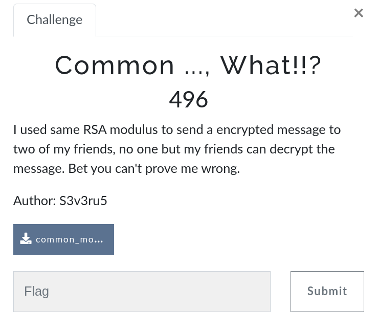

+++
title = "InvaderCTF writeups"
description = " My approch towards the CTF challanges authored by Team Invaders"
date = 2022-08-17T07:34:48+08:30
featured = false
draft = false
comment = false
toc = false
reward = true
categories = [ "CTF", "WriteUps", "Security"
]
tags = [ "Web", "Reverse", "pwn", "Crypto", "Misc"
]
series = []
images = ["images/compose.png"]
+++


### Introduction 
Hello mate, Sup?

Long time, no see ah? Don't worry, I'm coming. Here we go, Our new blog but this time with a different topic 🙃. Me, entering the world of CTFs and Application security. Playing “InvaderCTF” is my first step toward the path that I have chosen. And, at the end of the day, it’s a 🥳BANG! I'm able to secure my position in the Top 3.

Actually, I'm studying at RGUKT. Some of the alumni of our college called [Team Invaders](https://ctf.pwn.af/) conducted this CTF. 

There is a list of categories in this CTF such as “web”, “pwn”, “reverse”, “cryptography”, and “miscellaneous”. During CTF I was mostly dedicated to Web and Reverse categories. This CTF was conducted with a very basic level of challenges to encourage the students.. 

Randon Reader(RR): "Quick!"

Okay okay, let me explain the approch that I have followed to solve those challenges.

### MISC

##### Sniff

Challenge - [misc2.pcapng](https://ctf.pwn.af/files/1898a74ff07d1d8a9a8ad81886bd2730/misc2.pcapng?token=eyJ1c2VyX2lkIjo2LCJ0ZWFtX2lkIjpudWxsLCJmaWxlX2lkIjoyOX0.YwMhtA.hidJXLnP2WPA0SG7-qHlGyQjZS4), here is the file (sniffed packet).

1. Open .pcap file with wireshark, filter with http.
2. Found some captured traffic data, filter with "flag". We'll found a packet with /flag_in_authorization_header
3. Extract Authorization header value and decrypt with base64, got it! done.

```py
#Extracted header value 
token = "SW52YWRlckNURntOaWNlX3BjYXBfYW5hbHlzaW5nX3NraWxsc30="
import base64
flag = base64.b64decode(token)
print(flag)

# b'InvaderCTF{Nice_pcap_analysing_skills}'
```

##### Python2

```py
## This is the code that was given in chall.py
#!/usr/bin/python2

import flag
import sys

sys.stdout.write('''\t +++++ Even/Odd Calculator +++++
Enter a number: ''')
sys.stdout.flush()
inp = input()
sys.stdout.write('The number you entered is ' + str(inp))
if inp % 2 == 0:
    sys.stdout.write(' and it is even!')
else:
    sys.stdout.write(' and it is odd!')
sys.stdout.write('\n')
sys.stdout.flush()

exit()

```

Let me explain you about python2.* input.
In python2 there two ways to take an input from the user using input funtion. 
1. input() -> This function takes the value and type of the input you enter as it is without modifying any type.
2. raw_input() -> This function explicitly converts the input you give to type string.

Guess, what we can do. We can call funtions directly. Noice.

```bash
$ python2 chall.py
+++++ Even/Odd Calculator +++++
Enter a number: 1==1
The number you entered is True and it is even!

$ # wow it print resultant value, puck we catch it :P
$ # If you see in the code, the flag is being imported and the flag also in string format
$ # so we can see doc-strings and built-in function of flag module, lets try it
$ python2 chall.py
+++++ Even/Odd Calculator +++++
Enter a number: dir(flag)
The number you entered is ['__builtins__', '__doc__', '__file__', '__name__', '__package__','here_is_your_flag'] and it is odd!

$ # Yay, our flag is stored in here_is_your_flag, so can call it with flag.here_is_your_flag
$ python2 chall.py
+++++ Even/Odd Calculator +++++
Enter a number: flag.here_is_your_flag
The number you entered is InvaderCTF{python2_is_vulnerable_huh!} and it is odd!
```
##### Mnemonics

```py
## This is the code that was given in chall.py
#!/usr/bin/python3

list_of_words = ['abc', 'def', 'ghi']

flag = 'Dummy_FLAG' # Real flag is on the server

print('''Let's play a game :)
	Guess the words that comes to my mind.
	And if you guess it correctly everytime, 
	you will get the flag as reward!''')

WORD_COUNT = len(list_of_words)

index = 0
while (input('Enter the word (%s/%s): '%(index + 1, WORD_COUNT)) 
	== list_of_words[index]):
	index += 1
	if index == WORD_COUNT: 
		exit('Here is your flag: ' + flag)

exit('Nah, you got it wrong! The word is ' + list_of_words[index])

```
Boom, we got that.

Random Reader (RR) : What boom?

Me: See that last line, if we guess the wrong word, correct word is printing.

RR : Boom!


Haha!, Lets write a program cause there are 500 words to guess.
```py
from pwn import *
# for netcat connection
h = "198.199.123.169"
port = "9390"
conn = remote(h,port)
recvd = conn.recv()
conn.sendline(b'puck')
crct_ans = conn.recv()
print(crct_ans.split()[-1])
## prints correct word.
```

Now, if we are able to store the correct value in a list and then we can send it again to the program
cause if we made a false guess, then the program will end.
```py
from pwn import *
# for netcat connection
h = "198.199.123.169"
port = "9390"

crct_words = []
for i in range(500):
	conn = remote(h,port)
	recvd = conn.recv()
	for word in crct_words:
		conn.sendline(word.decode('utf-8'))
		flag = conn.recv()
	conn.sendline(b'puck')
	crct_ans = conn.recv()
	crct_words.append(crct_ans.split()[-1])
print(flag)
## prints flag -> InvaderCTF{Test_FLAG_123_Mnemonics}
```

### PWN

##### Food_Court_OverFlow

Challenge [court.zip,](https://ctf.pwn.af/files/48243982f9e28ccc05f9847405311322/court.zip?token=eyJ1c2VyX2lkIjo2LCJ0ZWFtX2lkIjpudWxsLCJmaWxlX2lkIjoyN30.YwOl9w.4cxtmv3vqgYytXVIGmAAOIVghXA) here you can download the challange zip file.

```c 
#include <unistd.h>
#include <stdio.h>
#include <stdlib.h>

int wallet = 200;

int order(char *item, int cost) {
    int n;
    printf("Input the number of %s you want to buy?\n", item);
    printf("> ");
    scanf("%d", &n);

    if (n > 0) {
        cost = cost * n;
        printf("That will cost Rs%d.\n", cost);
        if (cost <= wallet) {
            puts("Order placed!");
            wallet -= cost;
        } else {
            puts("Ah man, you don't have enough money to buy this order");
            n = 0;
        }
    } else {
        puts("Nah, buy something.");
    }

    return n;
}
void initialize()
{
  alarm(60);
  setvbuf(stdout, NULL, _IONBF, 0);
  setvbuf(stderr, NULL, _IONBF, 0);
  setvbuf(stdin, NULL, _IONBF, 0);
}

int main() {
    int item;
    puts("Welcome to RGUKT Food Court!");
    puts("We are giving free 200 RS wallet amount to our online customers.");
    puts("Sadly, you don't have enough money to buy the tastiest dish named Flag :/? Or is it? \n");

    while (1) {

        printf("Wallet Amount Rs%d.\n", wallet);
        puts("Menu: ");
        puts("1. Noodles: 50");
        puts("2. Biryani: 100");
        puts("3. Soft Drink: 20");
        puts("4. Flag: Rs 1000");
        puts("0. Logout\n");
        puts("Which item would you like to Order?");

        printf("> ");
        scanf("%d", &item);

        switch (item) {
            case 0:
                printf("Logging out");
                return 0;
            case 1:
                order("Nooooodles", 50);
                break;
            case 2:
                order("Dum Biryani", 100);
                break;
            case 3:
                order("Soft Drink", 1);
                break;
            case 4:
                if (order("buy the today's special dish - flag", 1000) > 0) {
                    FILE *fp = fopen("flag.txt", "r");
                    char flag[100];

                    if (fp == NULL) {
                        puts("Create flag.txt in the current working directory");
                        puts("Please report to admin if you saw this error on remote");
                        exit(1);
                    }

                    fgets(flag, sizeof(flag), fp);
                    puts(flag);
                }
                break;
            default:
                puts("Please select a valid item.");
        }
    }
}
```
The challenge name itself a big hint! lol🫂, the interger is declared as ```int```. 
we just need to give a number that belongs to out of the ```signed int``` range.

singed int range for 

- 2 or 4 bytes	(-32,768 to 32,767 or -2,147,483,648 to 2,147,483,647)

Lets understand the program, once input is taken, the program multiplied it with 1000,
and stores in int.

The overflow happens iff we give a number and when 1000 is multipled with it, the resultant must be greater than 2,147,483,647.

So we if input 21474836, then 21474836*1000 >> 2,147,483,647.
BAMM, done.

```sh
$ gcc court.c
$ ./a.out
Welcome to RGUKT Food Court!
We are giving free 200 RS wallet amount to our online customers.
Sadly, you dont have enough money to buy the tastiest dish named Flag :/? Or is it? 

Wallet Amount Rs200.
Menu: 
1. Noodles: 50
2. Biryani: 100
3. Soft Drink: 20
4. Flag: Rs 1000
0. Logout

Which item would you like to Order?
> 4
Input the number of buy the todays special dish - flag you want to buy?
> 21474836
That will cost Rs-480.
Order placed!
InvaderCTF{this_is_not_flag_flag_is_on_the_remote_server}
Wallet Amount Rs680.
Menu: 
1. Noodles: 50
2. Biryani: 100
3. Soft Drink: 20
4. Flag: Rs 1000
0. Logout

Which item would you like to Order?
> 

# BAMM, InvaderCTF{this_is_not_flag_flag_is_on_the_remote_server} here is our flag
```

### REV

##### pyencryptor

```py
#this is the code in chall.py
import random

# Two byte hash
def myHash(string):
    random.seed("H4shS33d" + string)
    num = random.getrandbits(16)
    return hex(num)[2:].zfill(4)

def encryptFlag(flag):
    enc = ""
    for char in flag:
        enc += myHash(char)
    return enc

flag = input("Enter flag : ")
enc = encryptFlag(flag)
print("Encrypted flag is : ", enc)

## Encrpted flag
# 08ef07973844262cd256a8635295ad53ece7518ae30f1fb9bdbfbfa9529526
# 2c1fb917ac757352956685500ebfa9cf347573d2566685bdbfbfa9cf34bdbff
# 2a30797b15a66856217cf34668507287573262c908276b5
```

Now, we need to write a reverse code to decrypt the flag. We already know, our flag contains InvaderCTF{ at beginning.

```py
import random

random.seed("H4shS33d"+"I") 
num = random.getrandbits(16)
print(number)
# 2287, is always generate same

h = hex(2287)[2:].zfill[4]
print(h)
# 08ef -> front [0:4] slice part of decrypted flag

# if we print 0x08ef -> 2287
```
BOOM, BAAMM, it done bro 🥲.

If we iterate a loop over all printable values, we can get our flag back

```py
import random
import string
flag = "08ef07973844262cd256a8635295ad53ece7518ae30f1fb9bdbfbfa95295262c" + \
"1fb917ac757352956685500ebfa9cf347573d2566685bdbfbfa9cf" + \
"34bdbff2a30797b15a66856217cf34668507287573262c908276b5"

flag = [flag[i:i+4] for i in range(0,len(flag),4)]
for j in flag:
	for i in string.printable:
		random.seed("H4shS33d"+i) 
		num = random.getrandbits(16)
		if int(j,16)==num:
			print(i,end="")
			break

# InvaderCTF{ch4ract3r_b4s3d_h4sh1ng_is_w3ak}
```

##### Crack_ME


challegen - [crack_me.pyc](https://ctf.pwn.af/files/9029de2a8b3fe1f3c73f8af512e6b673/crack.zip?token=eyJ1c2VyX2lkIjo2LCJ0ZWFtX2lkIjpudWxsLCJmaWxlX2lkIjoyM30.YwO4cg.W_dEqy4Gkgv8RCGSQs4Mtfp1lHU) is given in the zip file. 


1. I have used online decompiler to reverse .pyc file

```py
import random
random.seed(u'[5\x80E\x1d\x1aX\x91Z\x8f')

def encrypt(string):
    enc = []
    for char in string:
        temp = ord(char) + 120 ^ random.getrandbits(7)
        enc.append(temp)

    return bytearray(enc)


flag = input('Enter flag : ')
encFlag = encrypt(flag)
if encFlag == '\xd1\xe0\xb3\x9e\x80\xbf\xd3\x97\xa1\xda\x97\xdd\xe4\xef\xc9\xdf\x92\xff\xa2\xd5\x95\xfc\x99\xe6\xbc\xfa\xf5\xab\xd1\x89\xae\xd4\xe0\x94\xbb\x80\x96\x97\xa4\xd5\xd1\xe6\xce':
    print('Flag was right :)')
else:
    print('Nope')
```

This is the code we got it from decompiler, if our input matches to
``` 
'\xd1\xe0\xb3\x9e\x80\xbf\xd3\x97\xa1\xda\x97\xdd\xe4\xef\xc9\xdf\x92\xff\xa2\xd5\x95\xfc\x99\xe6\xbc\xfa\xf5\xab\xd1\x89\xae\xd4\xe0\x94\xbb\x80\x96\x97\xa4\xd5\xd1\xe6\xce'
``` 
this, then our input is the flag.

2. If you observe that, the seed is common for all bits. It means, how many time we run ```random.getrandbits(7)``` after seeding we get the same sequence values.

3. Now we just need to find which printable char is satisfied the condition  ```ord(i) + 120 ^ p == encFlag[]```

```py  
import random
import string

st = b'\xd1\xe0\xb3\x9e\x80\xbf\xd3\x97\xa1\xda\x97\xdd\xe4\xef\xc9\xdf\x92\xff\xa2\xd5\x95\xfc\x99\xe6\xbc\xfa\xf5\xab\xd1\x89\xae\xd4\xe0\x94\xbb\x80\x96\x97\xa4\xd5\xd1\xe6\xce'
random.seed(u'[5\x80E\x1d\x1aX\x91Z\x8f')
flag = []
j = 0
while j<43:
	p = random.getrandbits(7)
	for i in string.printable:
		temp = ord(i) + 120 ^ p
		
		if temp == st[j]:
			print(i,end="")
			break
	j+=1

# InvaderCTF{d3c0mpilati0n_m4kes_l1f3_e4si3r}
```

##### Binary


Challange - [Binary](https://ctf.pwn.af/files/95d830ac96fb32f78f48e5f639e5ed4d/bin.zip?token=eyJ1c2VyX2lkIjo2LCJ0ZWFtX2lkIjpudWxsLCJmaWxlX2lkIjoyNH0.YwPP0Q.fCzKZ5kezYfOOAVxRCJS-23rvfY), here is the link for zip file.

Once you download that file, you will find a gcc executable file, it containes the flag.

Searching the flag in strings
```sh
$ strings binary
.plt.sec
.text
.fini
.rodata
.eh_frame_hdr
.eh_frame
.init_array
.fini_array
.dynamic
.got
..
..

# No flag here
``` 

So, I tried to recover assemnbly code from binary executable. I used ghidra. And decompiled the executable.

```c
undefined8 verifyFlag(char *param_1){
  int iVar1;
  size_t sVar2;
  undefined8 uVar3;
  long in_FS_OFFSET;
  uint local_d4;
  int local_d0;
  int local_cc;
  uint local_c8 [46];
  long local_10;
  
  local_10 = *(long *)(in_FS_OFFSET + 0x28);
  sVar2 = strlen(param_1);
  if (sVar2 == 0x37) {
    iVar1 = strncmp(param_1,"InvaderCTF{",0xb);
    if (iVar1 == 0) {
      local_c8[0] = 0x37b;
      local_c8[1] = 0x352;
      local_c8[2] = 0x38c;
      local_c8[3] = 0x39f;
      local_c8[4] = 0x395;
      local_c8[5] = 0x3c8;
      local_c8[6] = 0x3bf;
      local_c8[7] = 0x3ca;
      local_c8[8] = 0x39a;
      local_c8[9] = 0x38f;
      local_c8[10] = 0x373;
      local_c8[11] = 0x3bd;
      local_c8[12] = 0x3b2;
      local_c8[13] = 0x3c3;
      local_c8[14] = 0x385;
      local_c8[15] = 0x3b7;
      local_c8[16] = 0x3bd;
      local_c8[17] = 0x37b;
      local_c8[18] = 0x38a;
      local_c8[19] = 0x37a;
      local_c8[20] = 0x3bc;
      local_c8[21] = 0x3a7;
      local_c8[22] = 0x3a1;
      local_c8[23] = 0x373;
      local_c8[24] = 0x37d;
      local_c8[25] = 0x3ab;
      local_c8[26] = 0x3ba;
      local_c8[27] = 0x3bb;
      local_c8[28] = 0x3b3;
      local_c8[29] = 0x3b6;
      local_c8[30] = 0x3e4;
      local_c8[31] = 0x3ef;
      local_c8[32] = 0x3bb;
      local_c8[33] = 0x3bd;
      local_c8[34] = 0x3f0;
      local_c8[35] = 0x3f0;
      local_c8[36] = 0x3eb;
      local_c8[37] = 0x3e9;
      local_c8[38] = 0x3ed;
      local_c8[39] = 0x3ba;
      local_c8[40] = 0x3f7;
      local_c8[41] = 0x437;
      local_c8[42] = 0x3fc;
      local_c8[43] = 0x3eb;
      for (local_d0 = 0; local_d0 < 0x2c; local_d0 = local_d0 + 1) {
        local_d4 = 0;
        for (local_cc = 0; local_cc < 0xc; local_cc = local_cc + 1) {
          local_d4 = local_d4 + (int)param_1[local_cc + local_d0];
        }
        if ((local_d4 ^ 0x7ff) != local_c8[local_d0]) {
          uVar3 = 0;
          goto LAB_00101454;
        }
      }
      uVar3 = 1;
    }
    else {
      uVar3 = 0;
    }
  }
  else {
    uVar3 = 0;
  }
LAB_00101454:
  if (local_10 != *(long *)(in_FS_OFFSET + 0x28)) {
                    /* WARNING: Subroutine does not return */
    __stack_chk_fail();
  }
  return uVar3;
}

```

I'm able to reverse the code, and get flag back using below code.

```py
import string

c8 = [0x37b,0x352,0x38c,0x39f,0x395,0x3c8,0x3bf,0x3ca,0x39a,0x38f,0x373,0x3bd,0x3b2,0x3c3,0x385,0x3b7, 0x3bd,0x37b,0x38a,0x37a,0x3bc,0x3a7,0x3a1,0x373,0x37d,0x3ab,0x3ba,0x3bb,0x3b3,0x3b6,0x3e4,0x3ef,0x3bb,0x3bd,0x3f0,0x3f0,0x3eb,0x3e9,0x3ed,0x3ba,0x3f7,0x437,0x3fc,0x3eb]

FLAG = "InvaderCTF{" #remaining
done = 0
for d0 in range(0x2c):
	d4 = 0
	for cc in range(0xc - 1):
		d4 = d4 + ord(FLAG[cc+d0])

	s = c8[done]^0x7ff
	FLAG+=str(chr(s-d4))
	done+=1

print(FLAG)

# InvaderCTF{cr4ck1ngs_b1nar1es_w1th_d3c0mp1ler5_i5_c00l}
```
### CRYPTO

##### Common_Modulus



Challange - [common_modulus](https://ctf.pwn.af/files/6763818d1a89636488f7d5f834d05e0a/common_modulus.zip?token=eyJ1c2VyX2lkIjo2LCJ0ZWFtX2lkIjpudWxsLCJmaWxlX2lkIjoxNn0.YwPVEA.FhWJGxtjn8oRg9w0k5AVM5pQtd8) here is the link to downlaod the zip.

Quick summary of RSA

ct = m**e % N

We have a message (the flag) encrypted with the same N

but with two different e. As the name suggests the solution to this problem is a common modulus attack

The idea of the attack is that if we know

    m**e1 % N

	m**e2 % N

GCD(e1,e2)=1

then we can recover m. And e1 and e2 are two random generated primes.
```sage

n = 11982945131022410542351081395449872615892579857707579658716659690935488669385262821057859182557738914580246000223393286594124225383866984597532935421878496300855873841201081561776719850279196185513497651311088240409358040299378330842236508619359647972763016690363235765860969655129269784424956130539800284778318098141912923725687592311652722505056107470370398021165270753993680221146964650298810348339426550121843506831513763524799788245715184019272818769688806186156054217173423142297185080827697102885478690188900539745266957938792259348667098941846582939290347898221569129727818304319228531810884419349788595299183
e1 = 1432834983003528423789566679766
e2 = 2379308237310255832902020443526
c1 = 10689309714150831372003282520258034721869267911572516423408248565049962108650099748793151534577215410589895845939174468496094911105822340567352621464826482784496348432260039948367408369277304473142781582593382249759117725426180831722441987089651228047819100128903524486005240635239107861739718852670683772477033147265282652735461836031051746173537294339800736436758373421135499142186805931851613817214123606130652548146050084102387221849254771049043101744791081688090961965211538682034166530987653637019819142642682927570692406882796783114872064728299928706994667553634162223654351719854271521012272876869577548029865
c2 = 10108112864771204039110360647151162379625435403389064742046377050800935678884417470071380911451172735126940164631419702014060618271946963698795724980506620687308126757038560340598588393457958478150419444430669593694549750182242922247396011389187919036956934428645928391159497083109718312975799586599853937652754710111738660741391329300491640624992257712646153846113376883043637423386066176238663086142253925553012932883285101598565990266200395298234059134450705194609356310121298248102541581987639348408092513592224044341173092657291900970886956196149689937412107716004555806327078173298630211025335704973121968612105

e1 = e1//2
e2 = e2//2

def solve(e1, e2, n, c1, c2):
	d, x, y = xgcd(e1, e2)
	m = (pow(c1, x, n) * pow(c2, y, n)) % n
	return m

message_2 = solve(e1,e2,n,c1,c2)
message = isqrt(message_2)
```
```py
from Crypto.Utils.number import long_to_bytes
_ = long_to_bytes(message)

print(_)

# InvaderCTF{common_modulus_the_attack_name_is_common_modulus}
```

##### Thanks for reading! {align=center}
