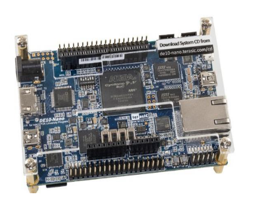
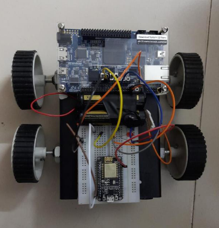
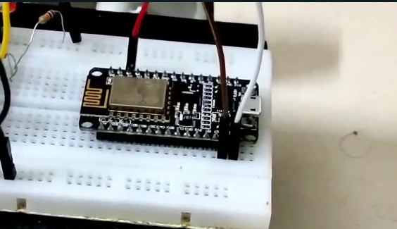
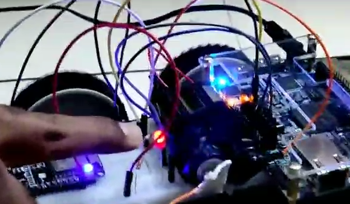

+++
title = "Vehicle Accident Detection Using FPGA"
description = "This project detects the accident of an vechile and sends alarm and notifications to parent’s or guardian’s phone"
date = 2021-12-31T07:34:48+08:30
featured = false
draft = false
comment = false
toc = false
reward = false
categories = [
  "FPGA"
]
tags = [
  "DE10Nano",
  "NodeMCU"
]
series = []
images = ["images/1.jpeg"]
+++
### Introduction 
Have you seen my previous post? If yes, I know you will definitely come here to see my new post.. 😌.
what if your answer is No? Then you will definitely come here next time🥲.

What's new this time🙄?... Vehicle Accident detection using FPGA 😮‍💨.

#### Ew? FPGA😦? What's that? 
Field Programmable Gate Arrays (FPGAs) are semiconductor devices that are based around a matrix of configurable logic blocks (CLBs) connected via programmable interconnects. FPGAs can be reprogrammed to desired application or functionality requirements after manufacturing.FPGAs contain an array of programmable logic blocks, and a hierarchy of reconfigurable interconnects allowing blocks to be wired together.An FPGA can be used to solve any problem which is computable. This is trivially proven by the fact that FPGAs can be used to implement a soft microprocessor.

I think its not just simple as I said. It's easy to understand and Hard to learn😉.

#### What actually we did in this project?
We had used the DE10Nano FPGA board to program. DE10Nano FPGA Board has 2 different parts:

1. FPGA    

2. HPS     --- Hard Processor System with a wealth of peripherals onboard for creating some interesting applications



The security of the vehicles can be achieved by using two
methods on road and the other one is off road. On road
means providing security from the accidents..So We are decided to Save lives from accidents. We are using ADXL sensor means Accelometer aka GyroScope, Magentometer to determine the vehicle position on the ground. 

Have you think that this idea is already developed in CHITRALAHARI(Telugu) movie 😒🤫? Whatever, but we dont take this idea from any movie. No means no🙄, we dont take it from there🥲, Haha...

Lets dive into the project development and let me explain the basics code for this system. It has developed using python, C, Embedded-C, Java the development of android application has done using eclipse and this overall implementation can run based on IOT.

Huh.. number of languagues🤔..Do we really need 4-5 languages or am I making some show off 😢? Ofcourse, Yes. Yes🙄? show off😅? No. Not for show off. In HPS, If we want to access accelometer we have to access via protocols using some code. So thats why I'm using C language to access. 
##### Including required libraries and Define paths for i2c protocol event file to access ADXL sensor.
```c
#include <stdio.h>
#include <sys/types.h>
#include <sys/stat.h>
#include <fcntl.h>
#include <error.h>
#include <stdlib.h>
#include <errno.h>
#include <limits.h>
#include <unistd.h>
#include <string.h>
#include "linux/input.h"

#define INPUT_DEV_NODE "/dev/input/by-path/platform-ffc04000.i2c-event"
#define SYSFS_DEVICE_DIR "/sys/devices/platform/soc/ffc04000.i2c/i2c-0/0-0053/"

#define EV_CODE_X (0)
#define EV_CODE_Y (1)
#define EV_CODE_Z (2)

#define LOOP_COUNT (1000)
```
##### Let me define a function to overwrite the files data to access ADXL
Initially the ADXL sensor is disabled. So we need to overwrite the data and enable the ADXL.
```c
void write_sysfs_cntl_file(const char *dir_name, const char *file_name,
		const char *write_str) {

	char path[PATH_MAX];
	int path_length;
	int file_fd;
	int result;

	// create the path to the file we need to open
	path_length = snprintf(path, PATH_MAX, "%s/%s",	dir_name, file_name);
	if(path_length < 0)
		error(1, 0, "path output error");
	if(path_length >= PATH_MAX)
		error(1, 0, "path length overflow");

	// open the file
	file_fd = open(path, O_WRONLY | O_SYNC);
	if(file_fd < 0)
		error(1, errno, "could not open file '%s'", path);
	
	// write the string to the file
	result = write(file_fd, write_str, strlen(write_str));
	if(result < 0)
		error(1, errno, "writing to '%s'", path);
	if((size_t)(result) != strlen(write_str))
		error(1, errno, "buffer underflow writing '%s'", path);

	// close the file
	result = close(file_fd);
	if(result < 0)
		error(1, errno, "could not close file '%s'", path);
}
```
##### Enable and Access ADXL sensor
We can enable adxl sensor in de10nano by writing "0" in /sys/devices/platform/soc/ffc04000.i2c/i2c-0/0-0053/disable file
```c
// enable adxl
write_sysfs_cntl_file(SYSFS_DEVICE_DIR, "disable", "0");

// set the sample rate to maximum
write_sysfs_cntl_file(SYSFS_DEVICE_DIR, "rate", "15");

// do not auto sleep
write_sysfs_cntl_file(SYSFS_DEVICE_DIR, "autosleep", "0");

// open the event device node
event_dev_fd = open(input_dev_node, O_RDONLY | O_SYNC);
```
So we enabled the ADXL sensor and already opened the device to get input values from ADXL sensor.
```c
if(event_dev_fd < 0)
		error(1, errno, "could not open file '%s'", input_dev_node);
	
	// read the current state of each axis
	printf("\n");
	for(i = 0 ; i < 3 ; i++ ) {
		result = ioctl (event_dev_fd, EVIOCGABS(i), &the_absinfo);
		if(result < 0)
			error(1, errno, "ioctl from '%s'", input_dev_node);
		
	}
	
	fflush(stdout);


	result = read(event_dev_fd, &the_event, 
			sizeof(struct input_event));
	if(result < 0)
		error(1, errno, "reading %d from '%s'", 
				sizeof(struct input_event),
				input_dev_node);
	if(result != sizeof(struct input_event))
		error(1, 0, "did not read %d bytes from '%s'", 
				sizeof(struct input_event),
				input_dev_node);

	// read the current state of each axis
	for(i = 0 ; i < 3 ; i++ ) {
		result = ioctl (event_dev_fd, EVIOCGABS(i), 
				&the_absinfo);
		if(result < 0)
			error(1, errno, "ioctl from '%s'",
					input_dev_node);
			
		abs_value_array[i] = the_absinfo.value;
	}
	printf("%d %d %d",abs_value_array[0],abs_value_array[1],abs_value_array[2])
```
Let me explain the above code, otherwise its looks like I copied from some source🤧.

I forgot to say that What is ADXL sensor and what it will return as output? Yeah, yeah We use ADXL sensor aka GyroScope in mobile phones also. I think that pubG also uses the Gyroscope and detect if players got accident😂. I am right amn't I🥱?

 Jokes apart. GryoScope is a device used for measuring or maintaining orientation and angular velocity. It is a spinning wheel or disc in which the axis of rotation (spin axis) is free to assume any orientation by itself.
So if we want to determine a position in a 3rd space we actually want x,y,z coordinates. Like this way ADXL sensor also return x,y,z coordinates of a device.
Those **x,y,z** coordinates are printed at last of the above code which are taken from device's triggered event.

So...! So what? I think now you guys also do this project.
What🤯? Did you detect any accident? No. Then How can you finish this blog here?...  What you guys are thinking is right, but I have explained you everything. Looks like I'm crazy, amn't I? Ofcourse, may be I'm😉.

Ok Let me explain in details how I finised, Dont worry..😌!
##### Accident detection using ADXL Sensor values
If you run a loop infinitely, what happens? what happens... system got stucked..😅. ussh🤫 Dont make jokes..
if we run a loop inifnitely, then we can calculate the difference between the values of coordinates in two consecutive seconds crosses threshhold of a normal vehicle position, then I considered it as an accident. But how?
how means ... the sudden changes in coordinates represent sudden movement compare to its normal speed. So If a sudden change in coordinate then I thought some collision is occured.
```C
int main(void) {
	int event_dev_fd;
	const char *input_dev_node = INPUT_DEV_NODE;
	int result;
	int i;
	int loop;
	struct input_event the_event;
	struct input_absinfo the_absinfo;
	int abs_value_array[3] = {0};

	int last_value_x=0;
	int last_value_y=0;
	int last_value_z=0;
	int x_abs_value_array=0;
	int y_abs_value_array=0;
	int z_abs_value_array=0;
	int check=1;
	
	system("chmod 777 /sys/class/gpio/export");
	system("echo 107 > /sys/class/gpio/export");
	system("echo out > /sys/class/gpio/gpio107/direction");
	system("echo 1 > /sys/class/gpio/gpio107/value");

	// enable adxl
	write_sysfs_cntl_file(SYSFS_DEVICE_DIR, "disable", "0");

	// set the sample rate to maximum
	write_sysfs_cntl_file(SYSFS_DEVICE_DIR, "rate", "15");

	// do not auto sleep
	write_sysfs_cntl_file(SYSFS_DEVICE_DIR, "autosleep", "0");
	
	// open the event device node
	event_dev_fd = open(input_dev_node, O_RDONLY | O_SYNC);
	if(event_dev_fd < 0)
		error(1, errno, "could not open file '%s'", input_dev_node);
	
	// read the current state of each axis
	printf("\n");
	for(i = 0 ; i < 3 ; i++ ) {
		result = ioctl (event_dev_fd, EVIOCGABS(i), &the_absinfo);
		if(result < 0)
			error(1, errno, "ioctl from '%s'", input_dev_node);
		
	}
	
	fflush(stdout);

	

	// read the next LOOP_COUNT events
	for(loop = 0 ;; loop++) {
		// read the next event
		result = read(event_dev_fd, &the_event, 
				sizeof(struct input_event));
		if(result < 0)
			error(1, errno, "reading %d from '%s'", 
					sizeof(struct input_event),
					input_dev_node);
		if(result != sizeof(struct input_event))
			error(1, 0, "did not read %d bytes from '%s'", 
					sizeof(struct input_event),
					input_dev_node);

		// read the current state of each axis
		for(i = 0 ; i < 3 ; i++ ) {
			result = ioctl (event_dev_fd, EVIOCGABS(i), 
					&the_absinfo);
			if(result < 0)
				error(1, errno, "ioctl from '%s'",
						input_dev_node);
				
			abs_value_array[i] = the_absinfo.value;
		}
		if (last_value_x!=0 || last_value_y!=0 || last_value_y!=0){
			if (((abs(abs_value_array[0]-last_value_x))>200 || (abs(abs_value_array[1]-last_value_y))>200) && ((abs(abs_value_array[0]-last_value_x))>200 || (abs(abs_value_array[2]-last_value_z))>200) && ((abs(abs_value_array[1]-last_value_y))>200 || (abs(abs_value_array[2]-last_value_z))>200)){
printf("%d\n",abs(abs_value_array[0]-last_value_x));
printf("%d\n",abs(abs_value_array[1]-last_value_y));
printf("%d\n",abs(abs_value_array[2]-last_value_z));
printf(" -- %d,%d,%d ----- \n",
					abs_value_array[0],
					abs_value_array[1],
					abs_value_array[2]
					);
			system("echo 0 > /sys/class/gpio/gpio107/value");
			printf(" ------------  accident occurs ----------\n");
			
			break;
			
			}

		if((abs(abs_value_array[0]-last_value_x))>300 || (abs(abs_value_array[1]-last_value_y))>300 || (abs(abs_value_array[2]-last_value_z))>300){
			printf("%d\n",abs(abs_value_array[0]-last_value_x));
printf("%d\n",abs(abs_value_array[1]-last_value_y));
printf("%d\n",abs(abs_value_array[2]-last_value_z));
			printf(" ------------- %d,%d,%d ----------------- \n",
					abs_value_array[0],
					abs_value_array[1],
					abs_value_array[2]
					);
			system("echo 0 > /sys/class/gpio/gpio107/value");
			printf(" ------------  accident occurs ----------\n");
			break;
			
			}
		
		}
		
		if (check%50==0){

			last_value_x = abs_value_array[0];
			last_value_y = abs_value_array[1];
			last_value_z = abs_value_array[2];
			printf("%d,%d,%d ----------------- \n",
					abs_value_array[0],
					abs_value_array[1],
					abs_value_array[2]
					);
			check++;
		}
		if (x_abs_value_array!=abs_value_array[0] && y_abs_value_array!=abs_value_array[1] && z_abs_value_array!=abs_value_array[2] ){
			check++;
			printf("%d,%d,%d --- %d\n",
					abs_value_array[0],
					abs_value_array[1],
					abs_value_array[2],
					check);
		}

		x_abs_value_array = abs_value_array[0];
		y_abs_value_array = abs_value_array[1];
		z_abs_value_array = abs_value_array[2];
		
	}
	

	result = close(event_dev_fd);
	if(result < 0)
		error(1, errno, "could not close file '%s'", input_dev_node);

	// disable adxl
	write_sysfs_cntl_file(SYSFS_DEVICE_DIR, "disable", "1");
}
```
[watch.c](files/watch.c)

In the above code, I power up the 107th gpio pin in DE10Nano when collision occured. Yooo We did it..!
What😵? .. You just did accident detection, but how others can notice that accident has been happend to thier vehicle? Author is irritating bro😖 huhh? 

Oooov oov O.. I just forget. Dont tease me bro😕,I will explain.


##### NodeMCU 
I have connected the 107th gpio output wire to NodeMCU to take input.
So when the 107th gpio pin is powered up, then the NodeMCU read the it and sends the data to CLOUD.
```C
#include <ESP8266WiFi.h>
#include <WiFiClient.h>
#include <ESP8266WebServer.h>

#include "Adafruit_MQTT.h"
#include "Adafruit_MQTT_Client.h"

#define AIO_SERVER      "io.adafruit.com"
#define AIO_SERVERPORT  1883
#define AIO_USERNAME    "g00g1y5p4"
#define AIO_KEY         "xxxxxxxxxxxxxxxxxxxxxxxxxxxxxxx"  // Obtained from account info on io.adafruit.com          
int i=0;
int s=0;
int k=0;
int n=0;
/* Set these to your desired credentials. */
const char *ssid = "SSID"; //Enter your WIFI ss
const char *password = "PASSWD"; //Enter your WIFI password


ESP8266WebServer server(80);
void handleRoot() {
      server.send(200, "text/html", "");
}


void handleSave() {
  if (server.arg("pass") != "") {
    Serial.println(server.arg("pass"));
  }
}

WiFiClient client;
 
// Setup the MQTT client class by passing in the WiFi client and MQTT server and login details.
Adafruit_MQTT_Client mqtt(&client, AIO_SERVER, AIO_SERVERPORT, AIO_USERNAME, AIO_KEY);
 
Adafruit_MQTT_Publish Attendance = Adafruit_MQTT_Publish(&mqtt, AIO_USERNAME "/feeds/iot");


void setup() {
  pinMode(LED_BUILTIN, OUTPUT);
  delay(3000);
  Serial.begin(115200);
  
  pinMode(0, INPUT_PULLUP);
  
  WiFi.begin(ssid, password);
  while (WiFi.status() != WL_CONNECTED) {
    delay(500);
    Serial.print(".");
  }
  pinMode(4, INPUT);
  
  server.on("/Python", handleRoot);
  server.on ("/save", handleSave);
  server.begin();
  connect();
}
void connect() {
  Serial.print(F("Connecting to Adafruit IO... "));
  int8_t ret;
  while ((ret = mqtt.connect()) != 0) {
    switch (ret) {
      case 1: Serial.println(F("Wrong protocol")); break;
      case 2: Serial.println(F("ID rejected")); break;
      case 3: Serial.println(F("Server unavail")); break;
      case 4: Serial.println(F("Bad user/pass")); break;
      case 5: Serial.println(F("Not authed")); break;
      case 6: Serial.println(F("Failed to subscribe")); break;
      default: Serial.println(F("Connection failed")); break;
    }
 
    if(ret >= 0)
      mqtt.disconnect();
 
    Serial.println(F("Retrying connection..."));
    delay(5000);
  }
  Serial.println(F("Adafruit IO Connected!"));
  if (! Attendance.publish("g00g1y")){
          Serial.println(F("Failed"));
            } else {
              Serial.println(F("Sent!"));
  }
}
void loop() {
  server.handleClient();

  if (digitalRead(0)== HIGH){
      i=0;
      Serial.println("LOW");
  }else if(digitalRead(0)==LOW && i==0 ){
    k=0;
    if (s==0){
          if (! Attendance.publish("reset")) {    
          //Publish to Adafrui
              Serial.println(F("Failed"));
            } else {
              i+=1;
              Serial.println(F("Sent!"));
          }
    }
  
  }
  delay(1000);
  if (analogRead(4)>=250 && k==0){
      if (n==0){
         n+=1;
          if (! Attendance.publish("g00g1yg00g1y")) {    
          //Publish to Adafrui
              Serial.println(F("Failed"));
            } else {
              k+=1;
              Serial.println(F("Sent!"));
          }
    }
  }else if(analogRead(4)<=200 && k!=0){
      n=0;
      
  }
}
```


[send_alarm.ino](files/send_alarm.ino)

And I created an Android Application to request the cloud data and if the accident code is detected then the alarm will play sound continuously through that application even if we terminate the Application's background process.



If accident occured... Led will blink.

[Vehicle-Accident-Detection-using-DE10-Nano](https://github.com/g00g1y5p4/Vehicle-Accident-Detection-using-DE10-Nano)

Hope you guys like and Subscribe to this Utube account 😂😂.

---

##### Thanks for reading! {align=center}
